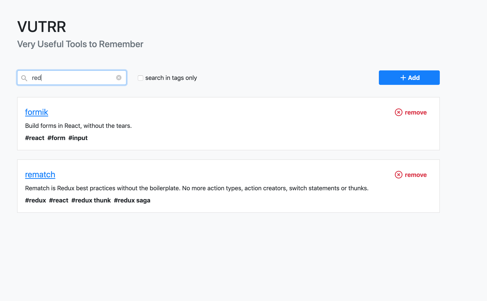

# react-vuttr-manager

A simple application to manage tools with names, links, descriptions and tags built using [React](https://github.com/facebook/react/).

## Summary

* [Dependencies](##Dependencies)
* [Installation Guide](##Installation-Guide)
  * [How to install](##How-to-install)
  * [Running](##Running)
* [Features](##Features)


## Dependencies

* [axios](https://github.com/axios/axios)
* [redux](https://github.com/reduxjs/redux)
* [rematch](https://github.com/rematch/rematch)
* [bootstrap](https://github.com/twbs/bootstrap)
* [formik](https://github.com/jaredpalmer/formik)
* [react-select](https://github.com/JedWatson/react-select)
* [reactstrap](https://reactstrap.github.io/)
* [yup](https://github.com/jquense/yup)
* [node](https://nodejs.org/en/)
* [yarn](https://yarnpkg.com/pt-BR/)

## Installation Guide


### How to install

Clone repository:
```
git clone https://github.com/cleandersonlobo/react-vuttr-manager.git
```
Install Dependencies
```
cd react-vuttr-manager && yarn install
```
Install Fake Api Dependencies 
```
cd server-mock && npm install
```

### Running

Server

```
yarn start
```

Start JSON Server 
http://localhost:3001

```
cd server-mock && npx json-server db.json --port 3001
```
Documentation [fake-api](https://gitlab.com/bossabox/challenge-fake-api/tree/master)

## Features

List Tools


Add new Tool


Remove Tool


Search tools in all parameters



Search tools in tags


